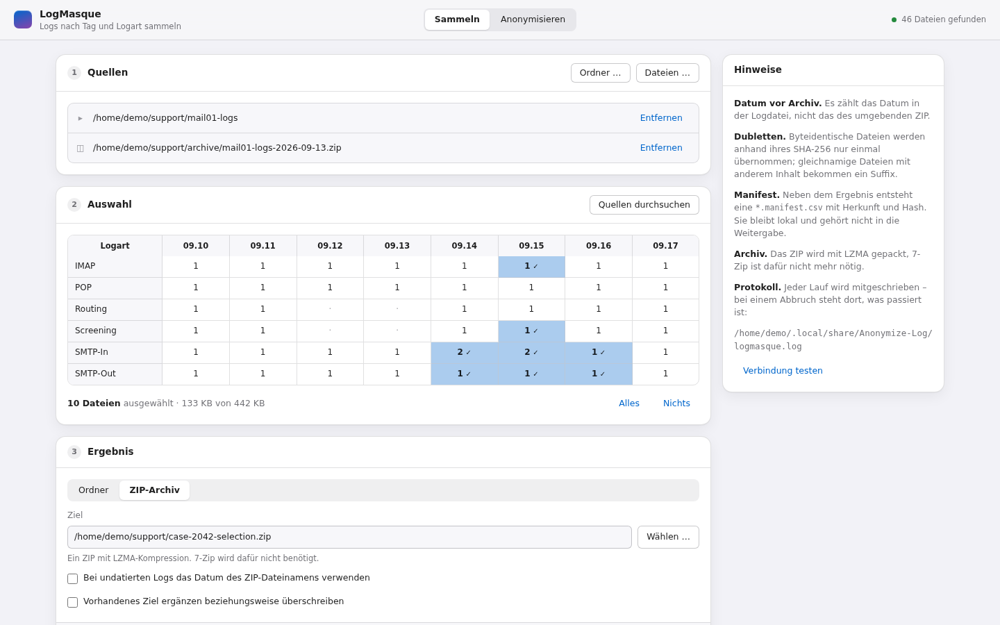
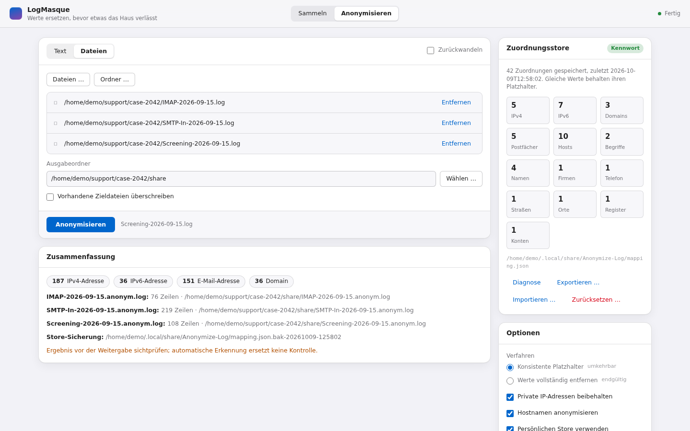
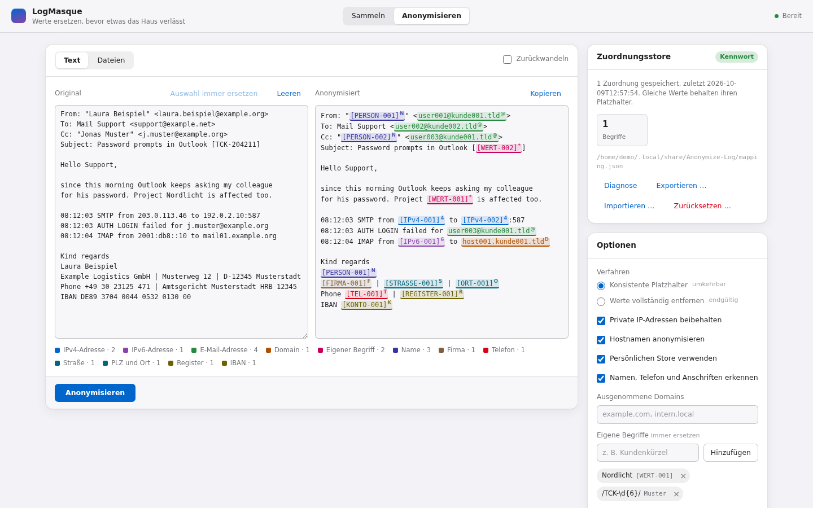
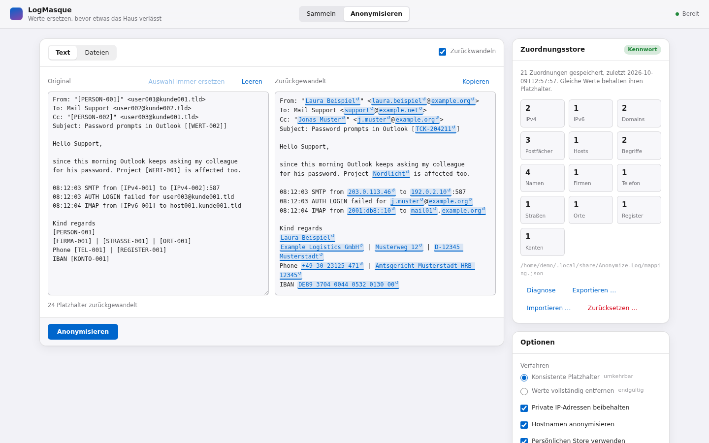

# LogMasque

**Mask the data. Preserve the context.**

Local-first log collection, archiving and reversible data sanitization for technical support.

## Overview

Support work often needs log files and mail threads that contain IP addresses, mail addresses, host names and the names of real people. LogMasque helps to share such material safely.

It does two jobs:

- **Collect:** pick log files by day and log type from folders and ZIP archives, remove duplicates and write a folder or a compressed archive.
- **Mask:** replace sensitive values with stable placeholders. The same IP address becomes `[IPv4-001]` in every file you process, so relationships in the data stay readable. Placeholders can be turned back into the original values on your own machine. Alternatively, values are removed for good.

Everything runs locally. The browser interface talks only to a server on `127.0.0.1`, and nothing is uploaded anywhere. LogMasque uses the Python standard library only and has no third-party dependencies.

> **Reversible pseudonymization is not anonymization.** Masked output can still identify people or systems through context, and anyone holding the mapping store can restore every value. Always read the result before you share it. See [Privacy and security considerations](#privacy-and-security-considerations).

## Interface preview

The German-language interface brings log collection and reversible masking into one local workspace. These screenshots use demonstration data and example paths.

### Log collection

Select log types and dates from folders and ZIP archives, then collect the selected files into a folder or archive.



<details>
<summary>Explore masking, before-and-after previews, and restoration</summary>

### File masking

Process several files together and review the replacement counts and output paths.



### Before and after

Compare the original text with highlighted placeholders for technical and personal data. Custom terms and patterns cover case-specific values.



### Restoration and mapping management

Restore placeholders using the matching local mapping store. The store panel provides counts, diagnosis, export, import, and reset controls.



</details>

## Features

### Collecting logs

- Detects the date in file names (`2026-04-06`, `2026_04_06`, `2026.04.06`, `20260406`) and treats the part before it as the log type, for example `SMTP-In` in `SMTP-In-2026-04-06.log`.
- Reads folders, single files and ZIP archives. ZIP contents are streamed; archives do not need to be extracted first.
- Optionally takes the date from the ZIP file name for files that carry none (`--container-date-fallback`).
- Shows a matrix of log types and days, so individual cells, rows or columns can be selected.
- Removes byte-identical duplicates by SHA-256. Files with the same name but different content are kept with a suffix such as `__2`.
- Writes a folder, a ZIP archive compressed with LZMA, or a `.7z` archive if 7-Zip is installed.
- Writes a local CSV manifest with source, log type, date, size and hash of every file. The manifest is kept out of the archive.

### Masking data

| Kind | Placeholder | Detected by |
|---|---|---|
| IPv4 address | `[IPv4-001]` | address syntax; private ranges can be kept |
| IPv6 address | `[IPv6-001]` | address syntax, including IPv4-mapped forms |
| Domain | `kunde001.tld` | domain syntax; file names such as `service.dll` are not domains |
| Mailbox (part before `@`) | `user001` | mail address syntax |
| Host label | `host001` | labels in front of the domain, for example `mx1` in `mx1.example.org`; can be switched off |
| PTR record | `[IPv4-001].in-addr.arpa` | reverse DNS names |
| Person | `[PERSON-001]`, `[NAME-001]`, `[VORNAME-001]` | context: sender lines, salutations, closings, role labels such as "Managing Director:" |
| Company | `[FIRMA-001]` | legal form (`GmbH`, `AG`, `Ltd`, ...) or a sender line |
| Phone number | `[TEL-001]` | international prefix or a label such as `Tel.`, `Fax`, `Mobile` |
| Street | `[STRASSE-001]` | street suffix with house number |
| Postcode and city | `[ORT-001]` | `D-12345 City`, or a postcode after a separator |
| Register entry | `[REGISTER-001]` | commercial register numbers (`HRB`, `HRA`, `VR`, `GnR`) and VAT IDs |
| IBAN | `[KONTO-001]` | IBAN syntax with a valid checksum |
| Own term or pattern | `[WERT-001]` | your own list of terms and regular expressions |

Placeholder names are partly German (`FIRMA`, `STRASSE`, `ORT`, `KONTO`, `WERT`, `kunde`). They are kept for compatibility with existing mapping stores.

Names cannot be told apart from other capitalized words by their shape. LogMasque therefore learns a name where the text marks it as one, for example after "Dear Mr." or below "Kind regards". It then replaces the name everywhere in the text, including places without such a hint. A surname shares the number of the full name, so `[PERSON-004]` and `Mr. [NAME-004]` read as the same person. Salutations and closings are recognized in German, English, French, Italian, Spanish and Dutch; German receives the most coverage.

Additional options:

- Keep private IPv4 addresses, keep host labels, and exclude domains (subdomains included).
- Own terms are plain text and case-insensitive; patterns are regular expressions. Both always get replaced.
- A "never replace" list takes back false positives.
- Free-text detection can be switched off for pure log files (`--no-personal`), which makes processing faster.
- Line endings are preserved, and bytes that cannot be decoded pass through unchanged.

### Checking and restoring

- `check` counts what still looks sensitive in a masked file and prints counts only, never values.
- `--restore` turns placeholders back into original values using the local mapping store.

## Installation and requirements

- Python 3.9 or newer. Tested on 3.9 to 3.14 on Linux.
- No third-party packages. `pip install` needs `setuptools` only to build the package.
- Windows or Linux. On Windows the mapping store is protected with DPAPI; elsewhere it is protected with a password. macOS has not been tested.
- 7-Zip only if you want `.7z` output.

There are two ways to run LogMasque:

1. **Single file.** Download `LogMasque.py` from the release page and double-click it, or run `python LogMasque.py`. Nothing else is needed. This suits locked-down workstations that allow Python but block other scripts.
2. **Package.** Install from a checkout:

   ```bash
   python -m pip install .
   logmasque --help
   ```

   Without installing, `python -m logmasque` works from the repository root.

## Quick start

Open the browser interface:

```bash
logmasque            # or: python LogMasque.py
```

Collect two days of SMTP logs from an archive folder into a ZIP file:

```bash
logmasque scan ./old-logs
logmasque collect ./old-logs --day 2026-04-06 --day 2026-04-07 --type "SMTP-*" --archive ./selection.zip
```

Mask a log file, check the result and restore it again:

```bash
logmasque anonymize ./SMTP-In-2026-04-06.log --out ./share
logmasque check ./share/SMTP-In-2026-04-06.anonym.log
logmasque anonymize ./share/SMTP-In-2026-04-06.anonym.log --restore
```

On Linux the first run asks for a password that protects the mapping store, with at least 12 characters.

## Browser interface

`logmasque` without a command, or `logmasque ui`, starts a local server and opens the interface in the default browser:

- **Collect:** add sources, scan them, select days and log types in the matrix, then write a folder or an archive.
- **Anonymize:** paste text or choose files.
  - A live preview highlights every replacement by kind.
  - Click a replacement to add it to "never replace".
  - Select text and choose "always replace" to add an own term.
  - Store export, import, reset and diagnosis are on the store card.

Security of the local server:

- It listens on `127.0.0.1` only, on a random port.
- Every API call must carry a random session token from the start URL.
- Requests with a foreign `Host` header are refused.

The interface is currently available in German only.

## CLI reference

```text
logmasque [--debug] [--version] <command> [options]
```

Without a command the browser interface starts. `--debug` writes verbose entries to the log file.

| Command | Purpose | Main options |
|---|---|---|
| `ui` | Start the browser interface | `--port`, `--no-browser` |
| `scan <sources...>` | List log types and days found in folders, files and ZIP archives | `--json`, `--extension` |
| `collect <sources...>` | Copy the selected logs into a folder or an archive | `--day` (repeatable, `yyyy-MM-dd`), `--type` (repeatable, wildcards allowed), `--out <folder>` or `--archive <file.zip/.7z>`, `--extension`, `--container-date-fallback`, `--force` |
| `anonymize <files...>` (alias `mask`) | Write masked copies next to the source or into `--out` | `--mode pseudonym\|redact`, `--keep-private-ip`, `--keep-hostnames`, `--keep-domain`, `--extra-pattern`, `--no-personal`, `--encoding`, `--no-store`, `--store`, `--restore`, `--mapping-csv`, `--force` |
| `check <files...>` | Count what still looks sensitive, without printing values; exit code 2 when something is found | `--encoding`, `--no-store`, `--store` |
| `store <action>` | Manage the mapping store: `info`, `check`, `selftest`, `export`, `import`, `reset`, `rows` | `--file <backup.anonstore>`, `--store`, `--force` |

Notes:

- Default extensions for `scan` and `collect` are `.log`, `.txt`, `.xml`, `.csv` and `.json`.
- Masked files are named `<name>.anonym.<ext>`, restored files `<name>.klartext.<ext>`. Existing outputs are kept unless `--force` is given.
- `store check` diagnoses a store that does not open and never writes.
- `store selftest` writes and reads back a throwaway store with this platform's protection; the real store is not touched.
- `store rows` prints the mapping in plain text. Treat that output like the store itself.

Environment variables:

| Variable | Purpose |
|---|---|
| `LOGMASQUE_STORE_PASSWORD` | Store password for unattended runs without DPAPI. Prefer the interactive prompt for real data. |
| `LOGMASQUE_LEGACY_DPAPI_ENTROPY` | Additional DPAPI entropy values, separated by `;`, for stores created by other builds. See [Mapping-store security](#mapping-store-security). |
| `LOGMASQUE_PRIVATE_VALUES` | Path to a private list of real values for the leak guard test. Used by the test suite only. |

## Pseudonymization versus redaction

| | Pseudonymization (`--mode pseudonym`, default) | Redaction (`--mode redact`) |
|---|---|---|
| Output | stable placeholders such as `[IPv4-001]`, `kunde001.tld`, `[PERSON-002]` | fixed texts such as `[IP-ENTFERNT]`, `[DOMAIN-ENTFERNT]`, `[NAME-ENTFERNT]` |
| Same value in different places | same placeholder, so relationships stay visible | indistinguishable |
| Reversible | yes, with the mapping store on the machine that created it | no |
| Writes the mapping store | yes | no |

Use pseudonymization when someone has to follow the data through a case and you need to map answers back to real systems. Use redaction when the recipient must not be able to link anything.

## Mapping-store security

The mapping store holds every original value and its placeholder. Anyone who can read it can undo the masking, so it is protected at rest and kept outside the project.

- **Location.**
  - Windows: `%LOCALAPPDATA%\Anonymize-Log\mapping.json`.
  - Linux: `${XDG_DATA_HOME:-~/.local/share}/Anonymize-Log/mapping.json`.
  - The folder keeps the name used by the earlier PowerShell anonymizer, so existing stores are found.
- **Windows:** protected with DPAPI for the current user account. Only that account on that machine can decrypt it.
- **Linux and other systems:**
  - Protected with a password of at least 12 characters, using PBKDF2-SHA256 (310,000 iterations), AES-256-CBC and HMAC-SHA256.
  - The file mode is set to `0600`.
  - Without a password, LogMasque refuses to process data, so it never produces output whose mapping cannot be saved.
- **Safe writes.**
  - Before every save the previous store is copied to `mapping.json.bak-<timestamp>`; the last five copies are kept.
  - A new store replaces the old one only after it has been read back and compared.
  - A store that cannot be opened is never overwritten by a normal save.
- **Portable backups.** `store export` and `store import` use the password-protected `.anonstore` format. This is the way to move a store between Windows accounts or to Linux. An import keeps a backup of the store it replaces.
- **DPAPI entropy.**
  - New stores are protected with the application value `LogMasque-Mapping-Store-v1`.
  - Stores of the earlier PowerShell anonymizer (`PowerShell-Log-Anonymizer-Mapping-v2`) open directly.
  - A store keeps the value it was written with, so the tool that created it can still open it.
  - A store created by a build with a different value opens once that value is supplied in `LOGMASQUE_LEGACY_DPAPI_ENTROPY`, or after an export and import.
  - The entropy is not a secret; protection comes from the Windows account.
- **Never share the store, its backups, `.anonstore` files, `--mapping-csv` output or the output of `store rows` together with masked data.** Deleting or resetting the store makes existing placeholders permanently irreversible.

## Supported input formats

- **Collection sources:** folders (searched recursively), single files and ZIP archives. 7z archives and nested archives are not read as sources.
- **Text to mask:** any line-based text file such as log files, mail exports, configuration files and CSV. Text can also be pasted into the interface.
- **Encodings:**
  - `--encoding auto` (default) honours a UTF-8 or UTF-16 byte order mark and otherwise reads Windows-1252. Bytes are preserved either way.
  - For UTF-8 files without a byte order mark, choose `--encoding utf8` so that non-ASCII names are detected correctly.
  - Other choices: `ansi`, `latin1`, `ascii`, `unicode` (UTF-16) and any Python codec name.
- **Archive output:** ZIP with LZMA compression (standard library), or `.7z` through an installed 7-Zip.

## Limitations

- **Detection is heuristic.** Names are found through context. A name that appears without any hint and was never learned stays in the text. Unusual phone or address formats can be missed, and capitalized words in signatures can occasionally be taken for names.
- **Language coverage.** The rules are tuned for German and English support mail and MDaemon-style logs. Other languages are covered only by the salutations and closings listed above.
- **Placeholder numbering.** Numbers depend on the order in which values are first seen.
- **Performance.** Free-text detection adds roughly half again to the runtime on large pure log files; `--no-personal` switches it off.
- **Restoring.** It only works with the same mapping store. Redacted output cannot be restored.
- **Interface language.** The browser interface is German only.
- **Platforms.** DPAPI protection is Windows-only; the Windows code path is not covered by the automated tests, which run on Linux and replace the DPAPI call with a stand-in.

Planned, not implemented: an English interface, configurable placeholder names and 7z input archives.

## Privacy and security considerations

- Masking reduces risk; it does not guarantee anonymity. Context such as timestamps, ticket numbers, rare error messages or the structure of a mail thread can still identify a person or a customer.
- Always review masked output before you share it. `logmasque check` helps but is not a substitute for reading the text.
- Keep the mapping store, its backups, exports and mapping CSV files private and out of version control. Do not send them together with masked data.
- The collection manifest and the log file `logmasque.log` (next to the store) contain local paths. They are diagnostic data for your machine, not material to share.
- Use only synthetic data in bug reports, tests and documentation.

Please report vulnerabilities as described in [SECURITY.md](SECURITY.md).

## Building the standalone version

`LogMasque.py` bundles every module and the web interface into one file that runs without the package:

```bash
python scripts/build_single_file.py                       # writes dist/LogMasque.py
python scripts/build_single_file.py --output ./LogMasque.py
```

The bundle imports its modules from memory and writes nothing next to itself. It is a build artifact: it is not committed and should be attached to releases.

Run the tests, including a build-and-run test of the bundle:

```bash
python -m unittest discover -s tests
```

## Contributing

Contributions are welcome. Please read [CONTRIBUTING.md](CONTRIBUTING.md) first. In short: standard library only, synthetic test data only, and tests for every change.

## License

LogMasque is released under the [MIT License](LICENSE).
